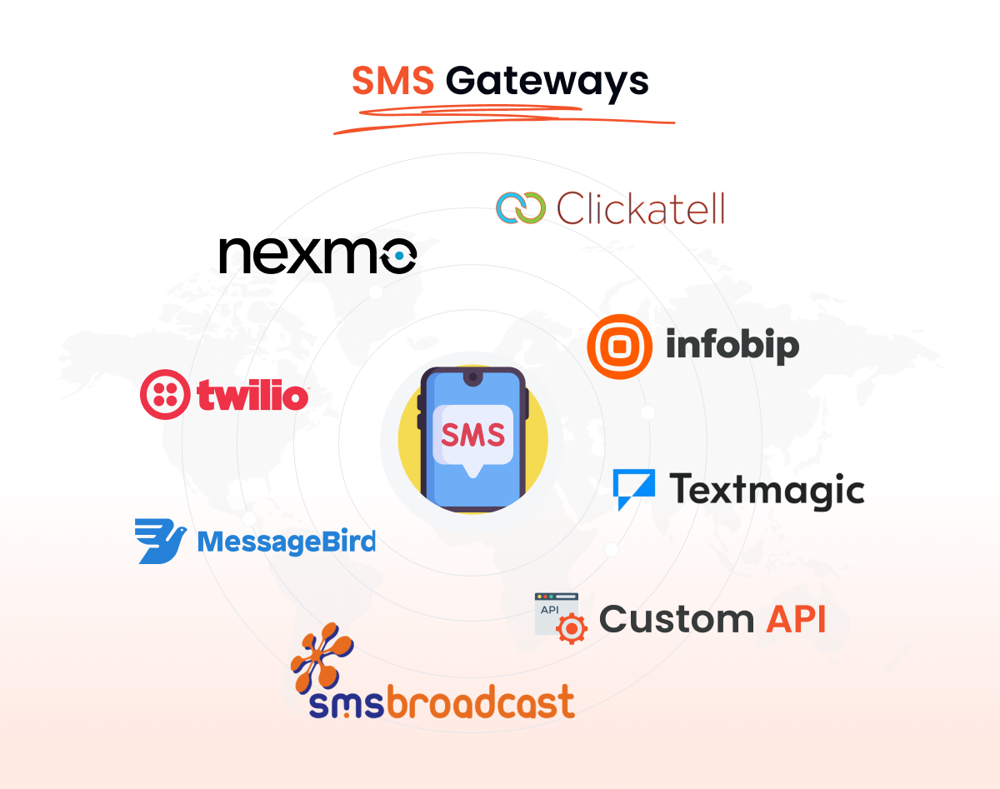

# EliveWave

<div align="center">

# بِسْمِ ٱللّٰهِ ٱلرَّحْمٰنِ ٱلرَّحِيمِ

### *Bismillahir Rahmanir Rahim*
**In the Name of Allah, the Most Gracious, the Most Merciful**

---

# السَّلاَمُ عَلَيْكُمْ وَرَحْمَةُ اللهِ وَبَرَكَاتُهُ

### *Assalamu'alaikum warahmatullahi wabarakatuh*
**May the peace, mercy, and blessings of Allah be with you**

---


# <span style="background: linear-gradient(135deg, #667eea 0%, #764ba2 100%); -webkit-background-clip: text; -webkit-text-fill-color: transparent; background-clip: text;">🛍️ EliveWave - Advanced E-Commerce Platform</span>

> **<span style="background: linear-gradient(90deg, #f093fb 0%, #f5576c 100%); -webkit-background-clip: text; -webkit-text-fill-color: transparent; background-clip: text;">A Powerful, Full-Featured E-Commerce Solution</span>** built with Laravel 11, PHP 8.3, and MySQL

<br/>

<!-- Status Badges -->
<div>


</div>

<br/>

<!-- CTA Section -->
<div>

### 🚀 [GitHub Repository](https://github.com/Moparapairayat/EliveWeave) • 📧 [Contact](#-contact) • ⭐ [Star Repo](https://github.com/Moparapairayat/EliveWeave)

</div>

---

</div>

A **production-ready e-commerce platform** designed for entrepreneurs, businesses, and merchants who demand a scalable, secure, and feature-rich online shopping solution. Built with enterprise-grade technologies and best practices.

#### ✅ What Makes This Special

<table>
<tr>
<td>

**Backend Excellence**
- 🚀 Laravel 11 with Turbo
- 💪 PHP 8.3+ compatibility
- 🗂️ RESTful API design
- 🔒 Advanced security

</td>
<td>

**Features & Functionality**
- 🛒 Complete shopping cart
- 💳 Multi-payment gateway
- 📦 Order management
- 👥 User & vendor system

</td>
<td>

**Business Tools**
- 📊 Analytics & reporting
- 🎯 Marketing automation
- 📧 Email notifications
- 🔐 Admin dashboard

</td>
</tr>
</table>

---

## <span style="background: linear-gradient(90deg, #ffa751 0%, #ffe259 100%); -webkit-background-clip: text; -webkit-text-fill-color: transparent;">✨ Features</span>

<table>
<tr>
<td width="33%">

### 🏪 **E-Commerce Core**
- ✔️ Product catalog & filtering
- ✔️ Advanced search system
- ✔️ Shopping cart & checkout
- ✔️ Multiple payment gateways
- ✔️ Inventory management

</td>
<td width="33%">

### 👥 **User Management**
- ✔️ Customer accounts
- ✔️ Order history
- ✔️ Wishlist & favorites
- ✔️ Product reviews & ratings
- ✔️ Vendor management

</td>
<td width="33%">

### 📱 **Admin & Vendor**
- ✔️ Admin dashboard
- ✔️ Vendor portal
- ✔️ Analytics & reports
- ✔️ Email campaigns
- ✔️ SEO management

</td>
</tr>
</table>

<details>
<summary><b>📊 Advanced Features (Click to expand)</b></summary>

#### 💳 **Payment Integration**
- 🛡️ Stripe, PayPal, Razor Pay
- 💰 Multiple payment methods
- 📋 Secure checkout process
- 🔐 SSL/TLS encryption

#### 📊 **Business Analytics**
- 📈 Sales analytics
- 📊 Customer insights
- 🎯 Product performance
- 🔄 Real-time reporting

#### 🎨 **Customization**
- 🎨 Responsive design
- 🌓 Light/Dark mode
- 🔧 Customizable theme
- ♿ Fully accessible

#### 📱 **SMS & Communication**
- 📲 Multiple SMS gateways (Nexmo, Twilio, Infobip, etc.)
- 📧 Email notifications with SMTP
- 💬 Customer messaging system
- 🔔 Real-time alerts
- 🌍 Global SMS coverage

<div align="center">
  
</div>

</details>

---

## 🚀 **<span style="background: linear-gradient(90deg, #00d2fc 0%, #3a7bd5 100%); -webkit-background-clip: text; -webkit-text-fill-color: transparent;">Tech Stack</span>**

<details open>
<summary><b>⚙️ Full Technology Stack (Click to expand)</b></summary>

### 🎯 Core Technologies

```
┌─ Backend Framework
│  ├─ Laravel 11 (PHP Framework)
│  ├─ PHP 8.3+ (Core Language)
│  ├─ Composer (Dependency Manager)
│  └─ Artisan (CLI Tool)
│
├─ Database & Cache
│  ├─ MySQL 8.0+ (Primary Database)
│  ├─ Redis (Caching & Sessions)
│  ├─ Query Builder (Eloquent)
│  └─ Migration System
│
├─ Frontend Technologies
│  ├─ Blade Templates (View Engine)
│  ├─ HTML5 & CSS3
│  ├─ JavaScript/jQuery
│  ├─ Bootstrap/Tailwind CSS
│  └─ Responsive Design
│
├─ Security & Authentication
│  ├─ Laravel Sanctum (API Auth)
│  ├─ BCrypt (Password Hashing)
│  ├─ CSRF Protection
│  └─ Role-Based Access Control
│
├─ Payment Integration
│  ├─ Stripe API
│  ├─ PayPal Integration
│  ├─ Razorpay
│  └─ Multiple Gateway Support
│
├─ Development Tools
│  ├─ Laravel Tinker (REPL)
│  ├─ Laravel Debugbar
│  ├─ PHPUnit (Testing)
│  └─ VS Code Extensions
│
└─ Deployment & Hosting
   ├─ Apache/Nginx Web Server
   ├─ XAMPP Development
   ├─ Docker Support
   └─ Module Hosting
```

### 📦 Key Dependencies

| Category | Package | Purpose |
|----------|---------|---------|
| **Framework** | `laravel/framework:11` | Web application framework |
| **Database** | `mysql/mysql-server:8` | Primary database |
| **Auth** | `laravel/sanctum` | API authentication |
| **Payments** | `stripe/stripe-php` | Payment gateway |
| **Email** | `phpmailer` | Email sending |
| **Testing** | `phpunit/phpunit` | Unit testing |
| **Security** | `hashids` | ID obfuscation |

</details>

---

## 📁 Project Structure

```
EliveWave/
├── 📂 core/                            # Laravel Application Root
│   ├── app/
│   │   ├── Models/                     # Database Models
│   │   ├── Http/
│   │   │   ├── Controllers/            # Application Controllers
│   │   │   ├── Middleware/             # HTTP Middleware
│   │   │   └── Helpers/                # Helper Functions
│   │   ├── Services/                   # Business Logic
│   │   ├── Providers/                  # Service Providers
│   │   └── Traits/                     # Reusable Traits
│   │
│   ├── config/                         # Configuration Files
│   │   ├── app.php
│   │   ├── database.php
│   │   ├── cache.php
│   │   └── mail.php
│   │
│   ├── database/
│   │   ├── migrations/                 # Database Migrations
│   │   └── seeders/                    # Data Seeders
│   │
│   ├── resources/
│   │   ├── views/                      # Blade Templates
│   │   │   ├── templates/
│   │   │   └── components/
│   │   ├── lang/                       # Language Files
│   │   └── css/                        # Stylesheets
│   │
│   ├── routes/                         # Route Definitions
│   │   ├── web.php                     # Web Routes
│   │   ├── api.php                     # API Routes
│   │   ├── admin.php                   # Admin Routes
│   │   └── user.php                    # User Routes
│   │
│   ├── storage/                        # File Storage
│   │   ├── app/
│   │   ├── logs/
│   │   └── framework/
│   │
│   ├── bootstrap/                      # Bootstrap Files
│   ├── public/                         # Web Root
│   ├── vendor/                         # Dependencies
│   ├── artisan                         # CLI Tool
│   ├── composer.json                   # PHP Dependencies
│   └── .env                            # Environment Config
│
├── 📂 assets/                          # Static Assets
│   ├── admin/                          # Admin Assets
│   ├── frontend/                       # Frontend Assets
│   └── images/                         # Image Repository
│
├── 📂 install/                         # Installation Files
│   ├── database.sql                    # Initial Database
│   └── index.php                       # Installation Wizard
│
├── index.php                           # Application Entry Point
├── .htaccess                           # Apache Configuration
└── README.md                           # Documentation
```

---

## 🚀 Getting Started

### ✅ Prerequisites

Ensure you have these installed:

```bash
PHP 8.3+  •  MySQL 8.0+  •  Composer  •  Git  •  Web Server (Apache/Nginx)
```

**Verify versions:**
```bash
php --version           # Should be PHP 8.3+
mysql --version         # Should be MySQL 8.0+
composer --version      # Latest version
```

### 🔧 Installation & Setup

#### Step 1️⃣ Clone Repository
```bash
git clone https://github.com/Moparapairayat/EliveWeave.git
cd EliveWeave
```

#### Step 2️⃣ Install Dependencies
```bash
cd core
composer install
```

#### Step 3️⃣ Environment Setup
```bash
# Create environment file
cp .env.example .env

# Generate application key
php artisan key:generate

# Configure database in .env
# DB_HOST=localhost
# DB_DATABASE=elivewave
# DB_USERNAME=root
# DB_PASSWORD=
```

#### Step 4️⃣ Database Setup
```bash
# Run migrations
php artisan migrate

# Seed initial data (optional)
php artisan db:seed
```

### ▶️ Running the Project

**Start development server:**
```bash
php artisan serve
```

**Output:**
```
Laravel development server started: http://127.0.0.1:8000
```

🎉 **Open** [http://localhost:8000](http://localhost:8000) in your browser!

---

## 🎨 Customization Guide

### 🎯 Configuration

Edit `core/.env`:
```env
APP_NAME=EliveWave
APP_URL=http://localhost:8000
DB_DATABASE=elivewave
DB_USERNAME=root
```

### 📝 Content Management

Edit database through:
- Admin Dashboard
- Direct database modification
- Artisan CLI commands
- Migration files

### 🏪 Add New Features

**Create a new migration:**
```bash
php artisan make:migration create_new_table --create=new_table
```

**Create a new model:**
```bash
php artisan make:model NewModel -m
```

**Create a new controller:**
```bash
php artisan make:controller NewController
```

---

## 🚀 Deployment

### 🔥 Deploy to Web Server

**Using XAMPP (Development):**
1. Place project in `htdocs/` folder
2. Start Apache & MySQL
3. Access via `http://localhost/EliveWave`

**Using Linux Server:**
```bash
# SSH into server
ssh user@your-server.com

# Clone repository
git clone https://github.com/Moparapairayat/EliveWeave.git

# Setup environment
cd EliveWeave/core
composer install
php artisan migrate
```

---

## 📝 Available Commands

<table>
<tr>
<td>

| Command | Purpose |
|---------|---------|
| `php artisan serve` | Start dev server |
| `php artisan migrate` | Run migrations |
| `php artisan tinker` | Interactive shell |
| `php artisan cache:clear` | Clear cache |

</td>
<td>

| Command | Purpose |
|---------|---------|
| `composer install` | Install PHP deps |
| `composer update` | Update packages |
| `php artisan db:seed` | Seed database |
| `php artisan make:*` | Generate files |

</td>
</tr>
</table>

---

## 🤝 Contributing

We ❤️ contributions! Here's how:

### 📝 Process

1. **Fork** the repository on GitHub
2. **Clone** your fork locally
3. **Create** a feature branch: `git checkout -b feature/awesome-feature`
4. **Make** your amazing changes
5. **Commit**: `git commit -m "feat: add awesome feature"`
6. **Push**: `git push origin feature/awesome-feature`
7. **Submit** a Pull Request

### 📏 Code Standards

- ✅ Follow **PSR-12** coding standards
- ✅ Write **meaningful comments**
- ✅ Use **type hints**
- ✅ Keep code **clean & readable**
- ✅ Write meaningful **commit messages**

---

## 📄 License

**MIT License** - Full commercial and private use permitted

<table>
<tr>
<td width="50%">

✅ **You Can**
- Use commercially
- Modify code
- Distribute copies
- Private use

</td>
<td width="50%">

📋 **You Must**
- Include license
- State changes
- Acknowledge author

</td>
</tr>
</table>

See [LICENSE](./LICENSE) file for complete details.

---

## <span style="background: linear-gradient(135deg, #f093fb 0%, #f5576c 100%); -webkit-background-clip: text; -webkit-text-fill-color: transparent; background-clip: text;">📧 Contact</span>

<div align="center">

### 🌍 **Let's Connect & Collaborate**

**Reach out across multiple channels:**

---

#### 🌐 **Global Presence**

[](mailto:Support@moparapairayat.com)
[](https://moparapairayat.com)
[](https://moparapairayat.uk)
[](https://moparapairayat.bd)
[](https://moparapairayat.sa)
[](https://moparapairayat.tr)

---

### 📍 **Regional Contact Hubs**

<table>
<tr>
<td align="center">

**🌍 Global**
- [moparapairayat.com](https://moparapairayat.com)
- 📧 [Support@moparapairayat.com](mailto:Support@moparapairayat.com)
- Int'l clients & services

</td>
<td align="center">

**🇬🇧 United Kingdom**
- [moparapairayat.uk](https://moparapairayat.uk)
- 📧 [Support@moparapairayat.uk](mailto:Support@moparapairayat.uk)
- UK-based services

</td>
<td align="center">

**🇧🇩 Bangladesh**
- [moparapairayat.bd](https://moparapairayat.bd)
- 📧 [Support@moparapairayat.bd](mailto:Support@moparapairayat.bd)
- Regional operations

</td>
<td align="center">

**🇸🇦 Saudi Arabia**
- [moparapairayat.sa](https://moparapairayat.sa)
- 📧 [Support@moparapairayat.sa](mailto:Support@moparapairayat.sa)
- ME & regional reach

</td>
<td align="center">

**🇹🇷 Turkey**
- [moparapairayat.tr](https://moparapairayat.tr)
- 📧 [Support@moparapairayat.tr](mailto:Support@moparapairayat.tr)
- Turkish & EU services

</td>
</tr>
</table>

---

### 💼 **Quick Links**

<table>
<tr>
<td>

| Platform | Link |
|----------|------|
| 📧 **Email** | [Support@moparapairayat.com](mailto:Support@moparapairayat.com) |
| 🌐 **Website** | [moparapairayat.com](https://moparapairayat.com) |
| 💼 **GitHub** | [Moparapairayat](https://github.com/Moparapairayat) |
| 🔗 **LinkedIn** | [Profile](https://linkedin.com/in/your-profile) |

</td>
</tr>
</table>

---

### 📧 **Official Business Emails**

**Always Active for Contracts & Inquiries:**

<table>
<tr>
<td width="50%">

[Moparapairayat@gmail.com](mailto:Moparapairayat@gmail.com)
→ General contracts

</td>
<td width="50%">

[Moparapairayatbd@gmail.com](mailto:Moparapairayatbd@gmail.com)
→ Bangladesh inquiries

</td>
</tr>
</table>

---

### 💬 **WhatsApp Project Inquiry Lines**

<table>
<tr>
<td align="center">

**🇺🇸 Personal Projects**
[+1 724-315-5810](https://wa.me/17243155810)

</td>
<td align="center">

**💼 Corporate/Large**
[+1 719-680-2913](https://wa.me/17196802913)

</td>
</tr>
<tr>
<td align="center">

**🤖 ML & AML**
[+8801955000704](https://wa.me/8801955000704)

</td>
<td align="center">

**🔒 Security & Servers**
[+8801305868621](https://wa.me/8801305868621)

</td>
</tr>
</table>

---

### 🚀 **Let's Build Something Great Together!**

Whether you have a project idea, need consultation, or just want to connect, reach out through any channel above.

</div>

---

## 📊 Project Statistics

<div align="center">

<table>
<tr>
<td>

⭐ **Stars**
Show your support!

</td>
<td>

🍴 **Forks**
Your contributions

</td>
<td>

👥 **Contributors**
Building together

</td>
<td>

📈 **Growth**
Join the community!

</td>
</tr>
</table>

**[Give a Star ⭐](https://github.com/Moparapairayat/EliveWeave) if you found this helpful!**

---

### Made with ❤️ by **MOPARA PAIR AYAT**

*Building powerful e-commerce solutions, one platform at a time.*

---

**[⬆ Back to Top](#elivewave)**

</div>
